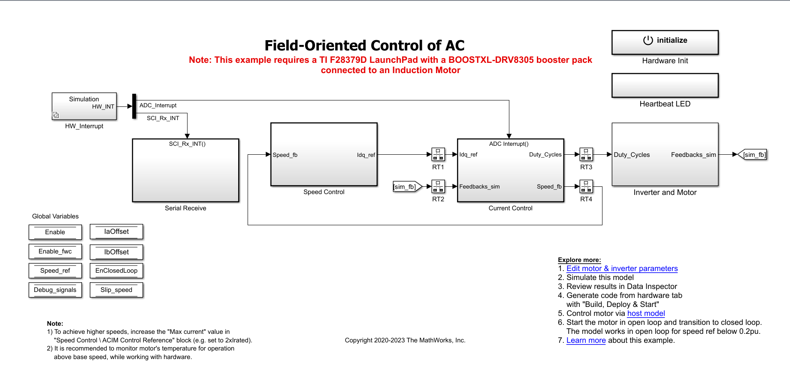
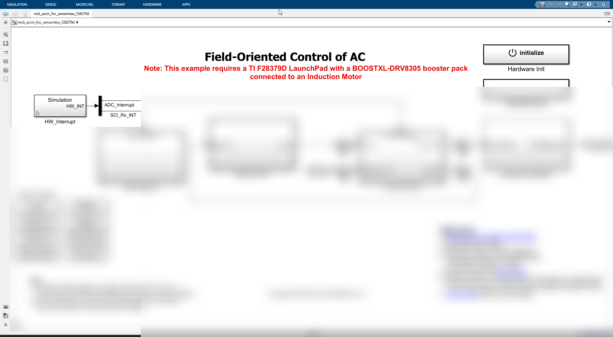
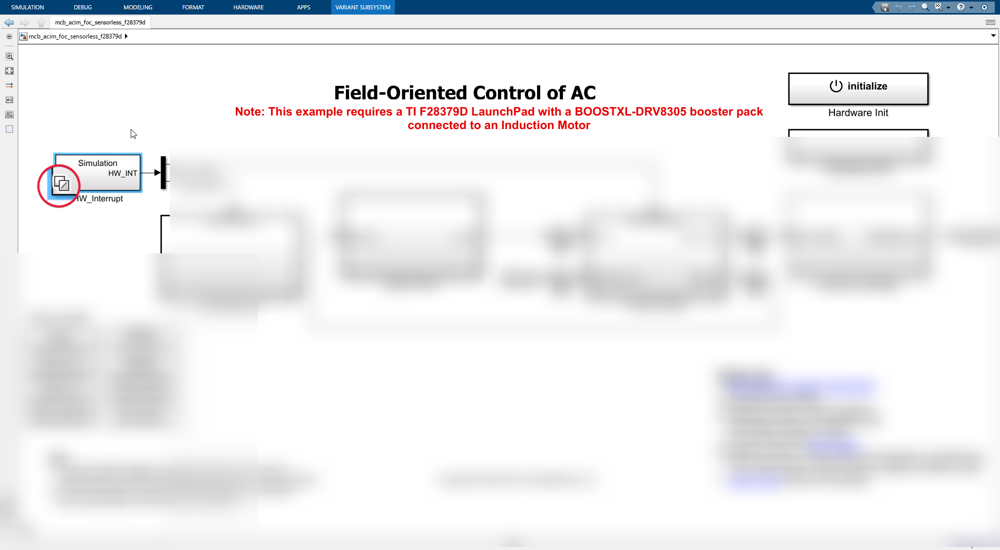
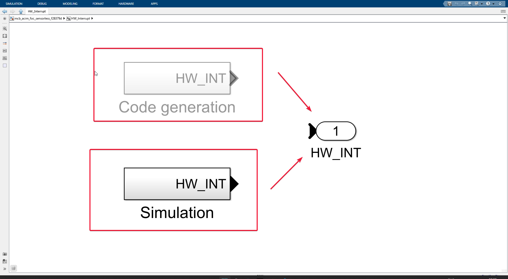
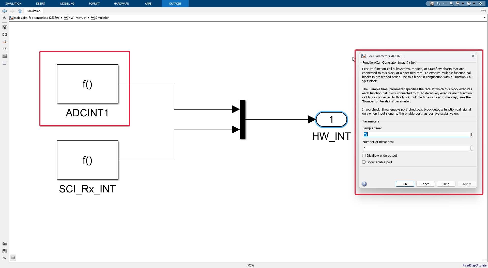
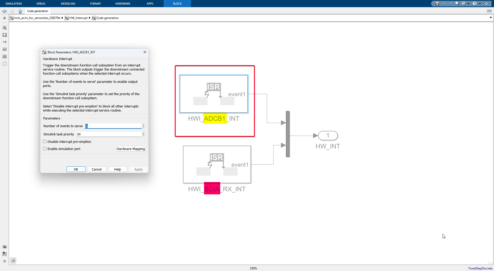

# Sensorless FOC ACIM Model Walkthrough

We need to understand that this model will be converted from a block diagram to C code, then to machine code, and will be sent to the C2000 where it will execute.

Let's dive into one block and explore its child blocks in depth.

### HW_Interrupt

Notice the HW_Interrupt block? Let's delve into it!

Before we proceed, did you notice the little icon with some sort of stacked squares?

- This icon indicates that this block will behave differently when operated in **simulation mode** and differently in **code generation mode**.

##### Simulation Mode
- As the name suggests, this is the mode when the user presses the Green Run button in Simulink.

##### Code Generation Mode
- This mode is activated when we are trying to generate C code for the C2000 and deploy it to hardware.

Since Simulink offers both hardware-specific blocks for deployment and general simulation tools in one package, we as users need to decide when to use which.

Obviously, when simulating the system on our **LAPTOP**, we don't need hardware-specific blocks, but when deploying, we certainly do. Once we delve into what is actually inside this block, we will get a clearer picture.

- We are now one level deeper, as mentioned earlier, there are two **sub-subsystems**, one for code generation and one for simulation.

- Notice that *none* of the blocks are connected to **HW_INT Port 1**. That's because Simulink will automatically route the appropriate block to **HW_INT Port 1** depending on what the *user* is attempting to do, whether code generation or just simulation on our laptop.

#### Simulation Subsystem

- Upon entering the **simulation subsystem** block, we see there are **two** function blocks connected to a mux, which is then connected to port 1, a hardware interrupt HW_INT.

- **f() ADCINT1**
  - The ADCINT1 function is an interrupt service routine that will be triggered by the ADC (Analog to Digital Converter) in real hardware. In our case, the ADC is connected to the motor terminal, measuring the current. (Don't worry about it for now.)
- **f() SCI_Rx_int**
  - Here, SCI stands for Serial Communication Interface, RX for reception, and INT for interrupt. So, this interrupt service routine will be called once we change any values, like the **desired motor speed** (which we will do from our laptop) that we would like to reflect in the motor. Thus, we need to stop all of our work, read what came on the serial communication, and update the control inputs.

> Imagine yourself as if you are sitting inside the C2000 microcontroller, and receiving means you are receiving something from the computer.

Backing out from the simulation subsystem and going up a level, we see the two blocks again.

Let's enter the Code-gen subsystem.
#### Code-gen Subsystem

- **HWI_ADCB1_INT**
  - Functionally, it is the same thing, but here we have a special hardware block, as you can see in the image. HWI stands for hardware interrupt. The C2000 microcontroller has 3 ADC modules; here, the interrupt is generated by the **ADC B1** module.

  - When we double-click on that block, we see two parameters: the number of events to serve and the Simulink task priority, which we don't need to bother with for now.
- **HWI_SCIA_RX_INT**
  - Just as there are different ADC modules, we also have different SCI or Serial Communication Interface modules. Here, we have chosen to transmit our control signals and inputs to the C2000 via the SCI channel A. So, the reception of any data on the SCI_A channel will generate an interrupt, and the changes will be transmitted to the Control system running inside.