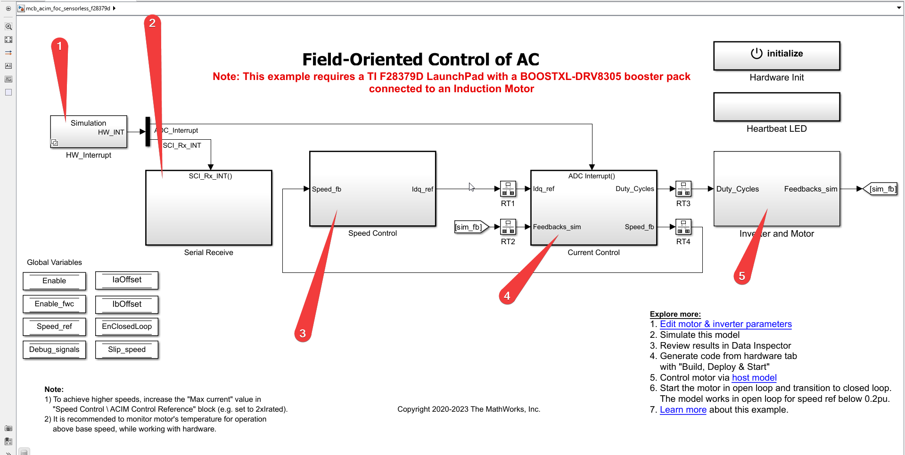

# F.O.C. Documentation

### List of each sub-system and their documentation, Click on it.

1. [HW_Interrupt](./HW_Interrupt.md)
2. [Serial Recieve](./Serial_Receive.md)
3. [Speed control](./Speed_control.md)
4. [Current Control](./Current_Control.md)
5. [Inverter and motor](./InverterMotor.md)

---

