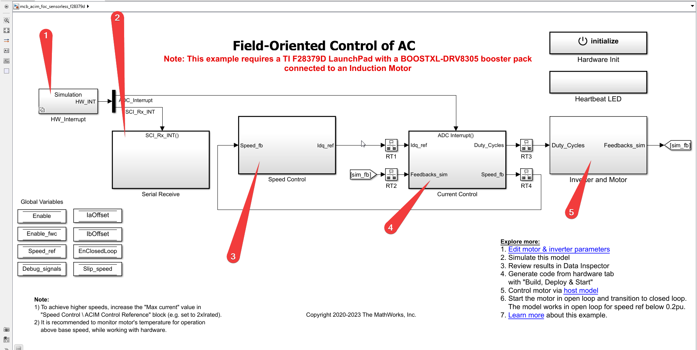

# F.O.C. Documentation

This is the documentation matlab simulink model of the sensorless Field Oriented Control (F.O.C.) of induction machine with the help of C2000 series, F2879D delphino launchpad by Texas Instruments.

### List of each sub-system and their documentation, Click on it.

1. [HW_Interrupt](./Writings/HW_Interrupt.md)
2. [Serial Recieve](./Writings/Serial_Receive.md)
3. [Speed control](./Writings/Speed_control.md)
4. [Current Control](./Writings/Current_control.md)
5. [Inverter and motor](./Writings/InverterMotor.md)

---

---
