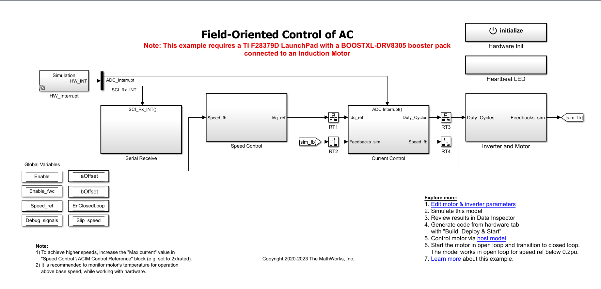
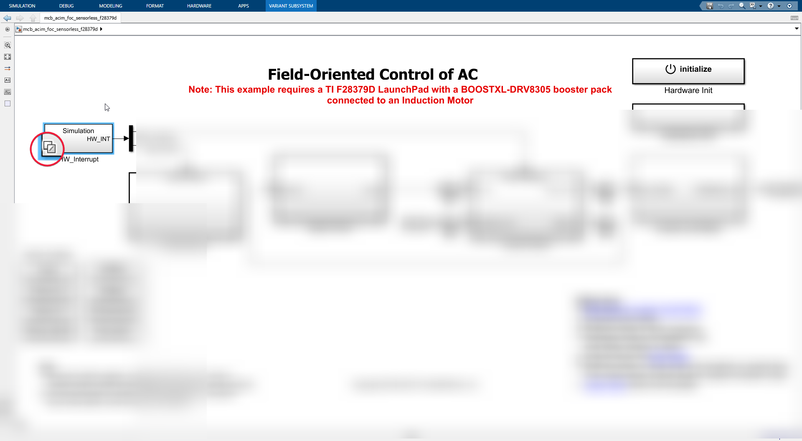

# Sensorless FOC ACIM model walkthrough.

- We need to understand that this model will be converted from block diagram --> C code --> machine code and will be sent to C2000 where it will excecute.

Let's take on one block and child block's inside it depth wise.

### HW_Interupt

See the HW_Interupt block? Yeah let's go in!

Before that notice little icon with some sort of stacked squares?

- Basically it indicates this block will behave differently when operated in **simulation mode** and differently in **code generation mode**

##### Simulation mode
- Self explanatory, this is the mode when user press the Green Run button in simulink.

##### Code generation mode
- This is when we are trying to generate C code for C2000 and deploying to hardware.

