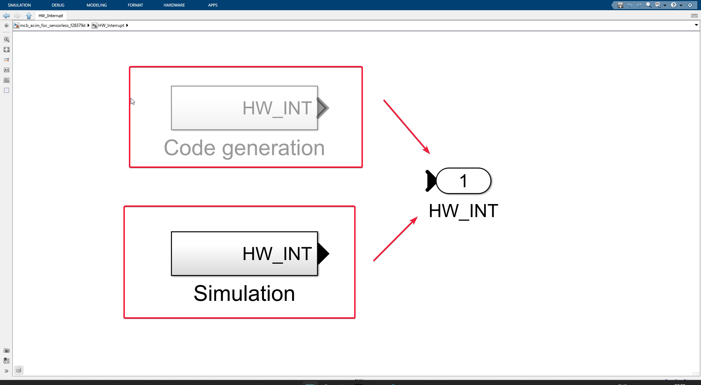

# Sensorless FOC ACIM model walkthrough.

- We need to understand that this model will be converted from a block diagram --> C code --> machine code and will be sent to C2000 where it will execute.

Let's take on one block and child block's inside it depth wise.

### HW_Interupt

See the HW_Interupt block? Yeah, let's go in!

Before that, notice the little icon with some sort of stacked squares?

- Basically, it indicates this block will behave differently when operated in **simulation mode** and differently in **code generation mode**.

##### Simulation mode
- Self-explanatory, this is the mode when the user presses the Green Run button in Simulink.

##### Code generation mode
- This is when we are trying to generate C code for C2000 and deploy it to hardware.

Since Simulink offers some hardware-specific blocks for deployment and general simulation tools all in one package, we as users need to decide when to use which.

Obviously, when simulating the system on our **LAPTOP**, we don't need hardware-specific blocks, but when we are deploying, we, of course, do need. Once we get in to see what is actually inside this block, we will get a clearer picture.

- Okay, we are +1 level deep, as I said earlier there are two **sub-subsystems**, one for code gen and simulation.

- Notice that *none* of the blocks are connected to **HW_INT Port 1**. That's because Simulink will automatically route the appropriate block to **HW_INT Port 1** depending on what the *user* tries to do, code gen or just simulation on our laptop.

#### Simulation subsystem

- Now we have entered the **simulation subsystem** block, we see there are **two** function blocks connected to a mux, which is then connected to a port 1, which is a hardware interrupt HW_INT.

- **f() ADCINT1**
  - The ADC int1 function is an interrupt service routine that will be triggered by the ADC, Analog to Digital Converter, in real hardware. In our case, the ADC is connected to the motor terminal, measuring the current. We will see what will happen after this interrupt is generated and we go to the actual control system of the field-oriented control.
- **f() SCI_Rx_int**
  - Here SCI is Serial Communication Interface, RX stands for reception, and INT stands for interrupt. So, this interrupt service routine will be called once we change any values, like the **desired motor speed** (which we will do from our laptop) that we would like to reflect in the motor, right? Thus, we need to stop all of our work, read what came on the serial communication, and update the control inputs.

> Note, you have to imagine yourself as if you are sitting inside the C2000 microcontroller, and the receive means you are receiving something from the computer.

#### Code-gen subsystem

- **HWI_ADCB1_INT**
  - Now, functionally it is the same thing, but we have a special hardware block, as you can see in the image. HWI stands for hardware interrupt. The C2000 microcontroller has 3 ADC modules; here, the interrupt is generated by the **ADC B1** module.

  - When we double-click on that block, we see two parameters, the number of events to serve and the Simulink task priority, which we don't bother with.
- **HWI_SCIA_RX_INT**
  - As there are different ADC modules, we also have different SCI or Serial Communication Interface modules. Here we have chosen to transmit our control signals and inputs to C2000 via SCI channel A. So, the reception of any data in the SCI_A channel will generate an interrupt, and the changes will be transmitted to the Control system running inside.