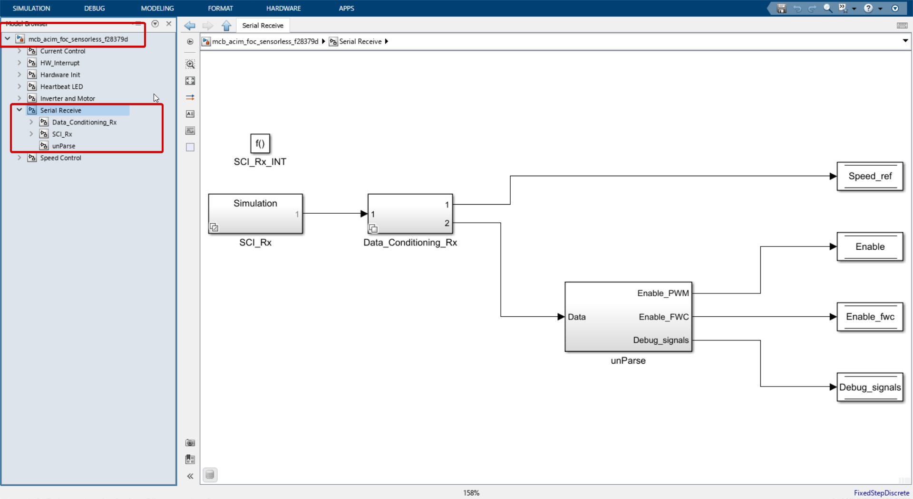
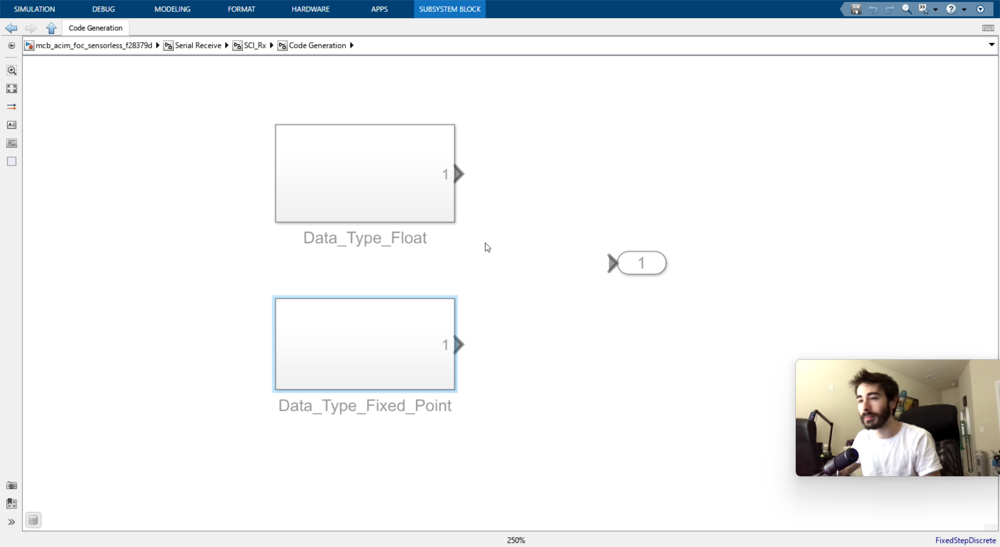
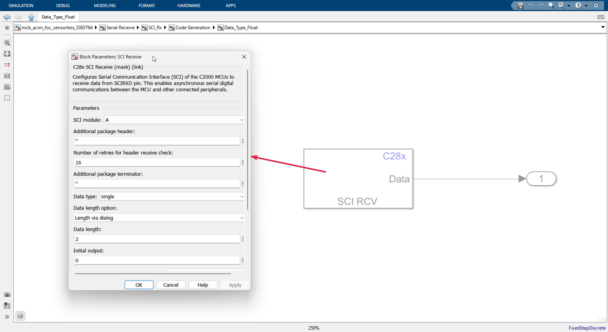
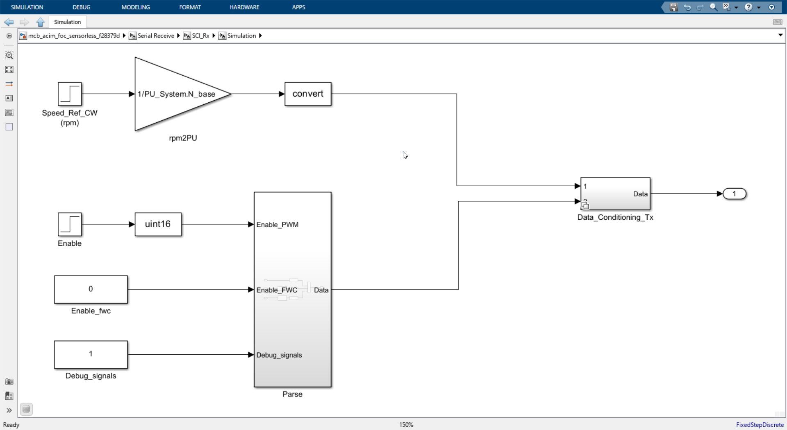

Make sure you have read the [HW\_Interrupt block](./HW\_Interrupt.md), as we will build upon it.

# SCI_Rx_INT()

Let's delve into the Serial Receive Block, responsible for obtaining data from the laptop or host computer regarding control inputs and updating global variables. This information is then utilized by the control system to update the desired speed and other control inputs.

Double-clicking on the block takes us inside.

There's a lot to unpack here, but don't worry. Follow the numbered references in the image as I explain:

1. **Function Definition**: Placing this block defines our current system as a function, allowing us to determine when this entire system will trigger execution. The Serial receive will only execute when the C2000 microcontroller detects changes in the control inputs, such as alterations in the desired speed from the host computer or laptop. Therefore, this function doesn't need to run every single time step; it only needs to run if there are signals coming through the serial channel. This is why it is called an interrupt service routine, which will only execute when there is an interrupt. In our case, our interrupt is receiving something on our serial communication channel, specifically SCI module A (see: [HW_interrupt block](./HW_Interrupt.md) on how this interrupt is generated).
2. **Code Generation and Simulation Modes**: The stacked squares at number **2** indicate that this block will run differently in code generation and simulation mode.
3. **Data Type-Dependent Operation**: The stacked squares at number **3** indicate that this block will run different subsystems depending on the data type it receives, such as fixed point and floating point.
4. **Control Signals and unParse Block**: We will look at this later.

### SCI_Rx (Codegen)

Here we see two subsystems, which have the exact same hardware block inside them and it gives its outputs to the port 1, just with a small modification in the block parameters in the data type column.

- The interrupt generation is complete, and the data is finally received by a hardware-specific block called CIRCV, which actually receives the data and stores it in the serial buffer, which will be read by the C2000 microcontroller.

### SCI_Rx (Simulation)

- Using the hardware serial reception block above was much easier. Now we have to emulate how the data will be received with all the nuances of data type conversion when running in a simulation environment, which is a bit more involved.

- Here, we need to create how the data is transmitted serially from the host computer. We have blocks like step input constant for this purpose. We need to convert it to the proper data type, mux it, and then convert it back to the proper data type.

- We have now completed our exploration of what's inside the **SCI_Rx** (block 2).

- **Data_Conditioning_Rx** (block 3) simply performs data type conversion of received data from the host computer in case of code generation or artificially emulated serial data as it would be received from the host computer.

#### unParse Block

As you might already know, serial communication has data arranged in time. We saw this in the emulation where we mux the data. So, we need to de-mux it to extract the data that has been sent. That is what is done here.

#### Data Store Write Block

The four control inputs are stored in a special block called **data store write block** (number 4 in the image). This block is not specific to C2000; it is a general Simulink block.

This is self-explanatory: the demultiplexed data and the speed reference, which came directly, are stored in a global variable-like block that will be read by the control system and updated wherever it is referenced.