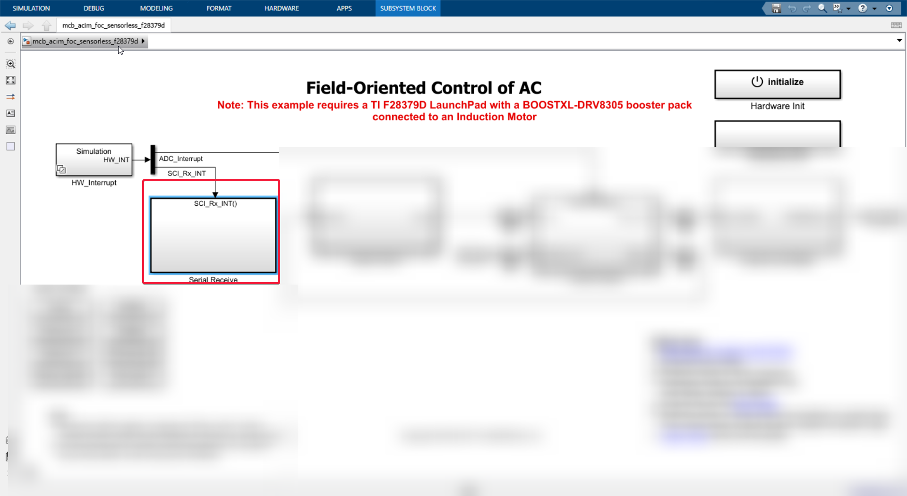
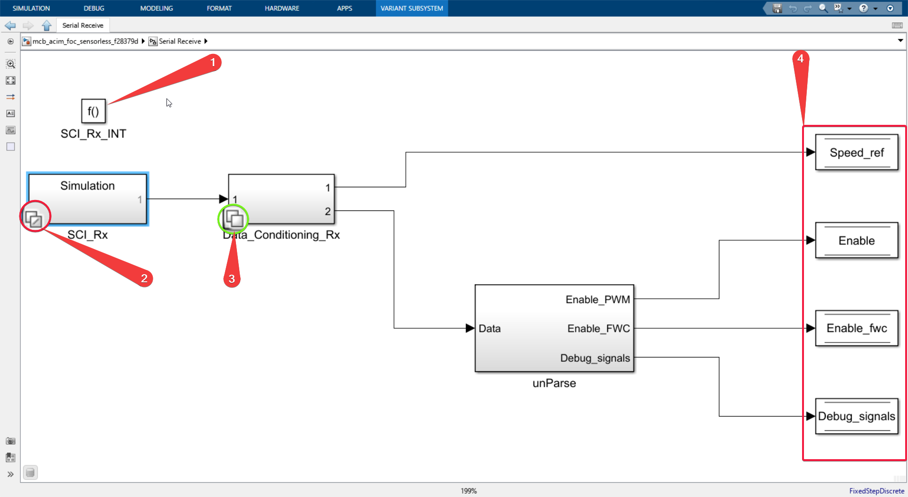

make sure you have read [HW_interrupt block](./HW_Interrupt.md), because we build upon it.

# SCI_Rx_INT()

- Now we shall go into the Serial Receive Block. This block will handle the function of getting the data from the laptop or host computer about the control inputs and it will update the global variables which will then get picked up by the control system to update the desired speed and other control inputs.

Let's double click and go in!

- Lot's to unpack here, Don't worry follow the numbers in the image that I will be refering to.

- See the number  **1**, Placing That block **defines** our current system as a function and we can change will this whole system will trigger excecution.

As we said earlier, the Serial receive will only execute when the C2000 microcontroller receives any changes in the control inputs like changing the desired speed from the host computer or laptop. So, this function doesn't need to run every single time step, it only needs to run only if there is some signals coming through the serial channel.

- That is why it is called an interrupt service routine, which will only execute when there is interrupt. In our case, our interrupt is receiving something on our serial communication channel, more particularly SCI module A (see: [HW_interrupt block](./HW_Interrupt.md) on how this interupt is generated).

- Look at the number **2** in image, same stacked squares Indicating that this will run differently, in code generation and simulation mode.

- Look at number **3** It looks like a similarly stacked squares, but It looks like stacked squares again, Indicating that it has two modes different mode of operation, but not on code generation and simulation, As we have seen earlier, but this stacked squares indicate it will run different subsystem. depending on the data type it receives. like fixed point and floating point.

- Look at number **4** As I have said earlier, the host computer may send different control inputs to the C2000 microcontroller. Here in this model, they have chosen four different control signals like speed reference, enable the system, enable FWC and debug signals. These are the four signals that shall be sent by host computer.

- Also there is a block called **unParse** which as the name implies parses or unpacks the data into three different control signals or the three different control signals is de-muxed.

