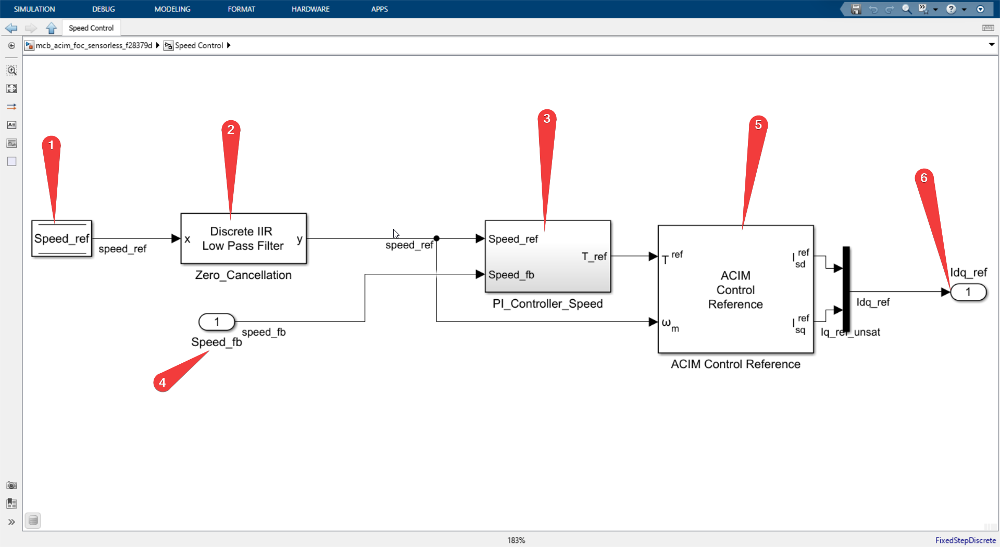

# Speed control




I will refer to numbers in the image above to explain follow along.

**Numbered 1**
It's the DataStoreRead block which holds the speed reference value which we send from our host computer through serial communication.


**Numbered 2**
It's Discrete IIR lowpass filter block which is added to the plant cancel the Zeros (the one which makes the output of transfer function to zero) by adding poles.

So effectively we are adding poles by adding this filter to cancel the zeros in our system. 

`IIR_filter_speed.coefficient*(Ts_speed/Ts)` is filter coefficient. 

Ts is sample time of the system and Ts_speed sample time of the speed control system.
```
Ts          	= T_pwm (1.0/20Khz in our case)

Ts_speed        = 30*Ts
```


**Numbered 3**
It's the Discrete PID Controller with anti-windup block which takes speed_ref and speed_fb as input and generates torque_ref as output.


more closer look into the PID block

Follow the numbers in the image above to understand the PID block.

1. -> Proportional gain
2. -> Integral gain * Sample time of this system Ts_speed
3. Boolean flag `EnClosedLoop` is used to reset the integrator when the system enters the closed loop.

The reset signal is level triggered 

Source: Docs of Discrete PID Controller with anti-windup block (which can be opened by right clicking on the block and clicking on the help)


4. Initial condition of the integrator is set to 0.0

**Numbered 4**

is a port which is from current motor speed feedback value estimated by the Speed Estimation block.

**Numbered 5**


ACIM Control reference, This is inbuilt block in the ACIM Control library which takes torque_ref and speed_ref as input and generates Isd_ref and Isq_ref as output, which are the reference values for the current control loop.

As you can see this block takes a lot of machine specific parameters like rated flux, poles, rated speed, inductances and generates the Id and Iq reference values.


This completes the speed control system.
Next: [Current control](Current_control.md)