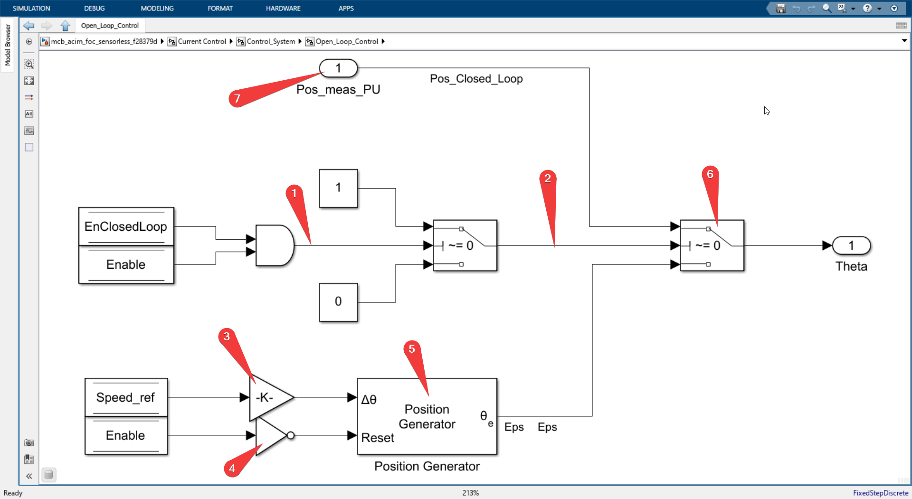

 

Here is where actual control system is implemented. All the values we calculated in the previous block are used here, Idq_ref, Iab_meas_PU, POS_PU, Speed_PU, and the output of this block is the voltage V_abc reference for the inverter.


 

## Open_loop_Control subsystem



Inside the subsystem we see the position measured per unit which is the signal port 1 labeled 7 comes from the flux observer block in the previous subsystem we saw. So that is the position of the stator flux which goes to the theta only if the enable close to flag and enable flag both are 1. So you can easily verify it from the logic gates.


else so if any of the condition is false that is if enable closed loop is false which means the system is running in the open loop mode or the enable is false which disables the complete systems so if any of those two is false then we go to the below labeled block number five which generates position based on the speed reference and the gain K labeled 3 is nothing but

`Ts*PU_System.N_base*acim.p/60`

Where
- Ts is the sampling time
- PU_System.N_base is the base speed of the motor
- acim.p is the number of pole pairs of the motor
- 60 time conversion factor.

The position generator block is inbuilt in the simulink library and is used to generate the position of the stator flux in the open loop mode given the speed reference.

**DQO transformation**

After we get theta that is stator flux position either in the open loop or the closed loop mode. We use that theta to compute sin theta and cos theta which is used by the Park transform block to calculate the DQ components of the stator currents and these transformed DQ currents is fed into the current controllers block.

## Current controllers


The current controllers are implemented in the `Control_System` with all the debug signals.


For the sake of explanation I have removed all the debugging signals and the signals which can distract us from the main goal of understanding the current controllers.

The inputs to this block are

- Idq_ref (which we get from the speed control system)
- Id_fb and Iq_fb (which are transformed currents from the park transform block)
- Wm_fb (which is estimated speed of the rotor from the speed estimation block we saw in the input scaling block)

- The system begins by applying Proportional-Integral (PI) controllers to the q-axis and d-axis currents of the induction machine. These controllers generate a reference voltage based on the difference between the reference current and the feedback current. The aim of this step is to minimize the error between the actual and desired currents.

- Next, a limiter is applied to the d-axis and q-axis reference voltages. This step ensures that these voltages don't exceed certain thresholds, thus preventing potential damage to the system or suboptimal operation. The limiter also calculates the magnitude of the reference vector.

- The limited or saturated d-axis and q-axis voltages are then assigned as the reference voltages. This step ensures that the reference voltages used in the subsequent steps of the process are within the safe operating limits of the system.

- Following this, a low-pass Infinite Impulse Response (IIR) filter is applied to the magnitude of the reference vector. This step is designed to smooth out the reference signal, reducing high-frequency noise and fluctuations that could negatively impact the performance of the system.

- The system then sets a maximum reference voltage. This is a predetermined value that represents the highest voltage that the system is designed to handle.

- The next step involves a feedforward controller, which uses the maximum reference and feedback voltages to generate a corrective d-axis current. This current is designed to anticipate and correct potential errors or disturbances in the system, improving its overall performance.

- The corrective current from the feedforward controller is then added to the reference d-axis current. This step adjusts the reference d-axis current based on the output of the feedforward controller, further fine-tuning the control of the system.

- Finally, a saturation function is applied to the adjusted d-axis current. This step ensures that the current stays within specified limits, reducing the operating level of the system if necessary to prevent overloading or overheating. This is the derating process, which is designed to ensure safe and reliable operation of the system under different conditions.

> The above explanation was generated with GPT-4, by giving this pseudo code which I gave
```csharp
// PI_controller_Iq funtion
(float V_ref) PI_controller_Iq(I_ref, I_fb);
(float V_ref) PI_controller_Id(I_ref, I_fb);
(dsat, qsat, magref)DQLimter(d_ref, q_ref)
Vd_ref = dsat
Vq_ref = qsat

Vmax_fb = LP_IIRfilter(magref)
Vmax_ref = 0.9

// FWC_Derating
Id_fwc = FW_controller(Vmax_ref,Vmax_fb)

Id_ref_unsat = Id_ref + Id_fwc
Id_ref_unsat = saturation(Id_ref_unsat, upperLim = 0.5, lowerLim = 0.05) 
```
https://chatkit.app/s/MBWSDeSxxSD-HjYUh4B1x

After that, we transform the output reference voltage, direct and quadrature voltage into alpha, beta.

The alpha beta frame voltages is given to **PWM reference generator** block which is an inbuilt block in MATLAB and the various pulse width modulation techniques can be selected. For now we have selected a space vector modulation. So this block gets the V alpha V beta voltages and generates the three phase voltages in the stator frame which after scaling can be given directly to the gate pulses of the inverter.


[Slip speed estimator](./slipSpeedEstimator.md)