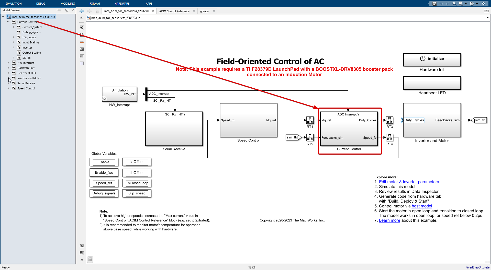
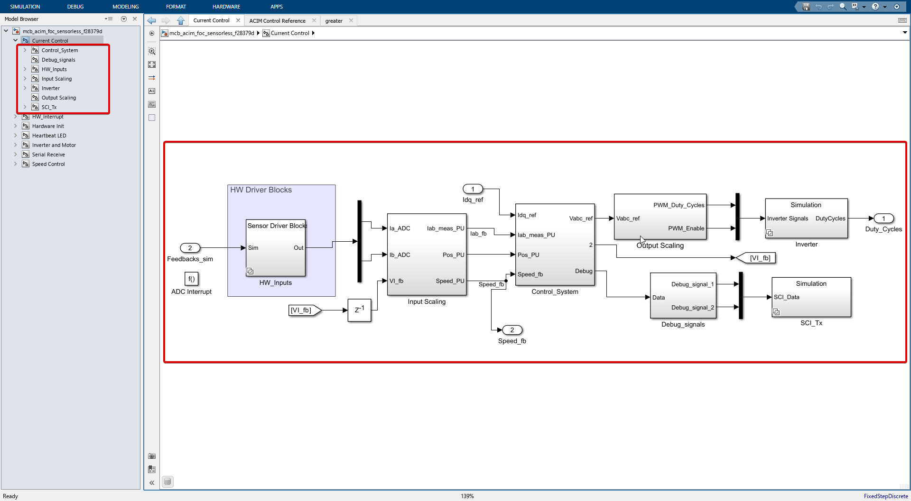

# Current control

This is where guts of FOC lies.

- As we can see in the above image there are 2 inputs to this Current control system, Namely

    - Idq_ref from the speed control system.
    - Feedback_sim signal from the inverter and motor system which is nothing but motor currents of Ia and Ib.

- When we go into the current control subsystem we see there are 7 blocks in total.

- As shown in the tree view (model browser) to the left of the image.

  - **Current Control**
    - HW_Inputs
    - Input Scaling
    - Control_System
    - Output Scaling
    - Inverter
    - Debug_signals
    - SCI_Tx

- Let's go through each of these blocks one by one.

---
## HW_Inputs
[HW_Inputs](./HW_Inputs.md)

## Input Scaling
[Input Scaling](./Input_Scaling.md)

## Control_System
[Control_System](./Control_System.md)

## Output Scaling
[Output Scaling](./Output_Scaling.md)

## Inverter
[Inverter](./Inverter.md)

## Debug_signals
[Debug_signals](./Debug_signals.md)

## SCI_Tx
[SCI_Tx](./SCI_Tx.md)

---