# Current control

This is where guts of FOC lies.

- As we can see in the above image there are 2 inputs to this Current control system, Namely

    - Idq_ref from the speed control system.
    - Feedback_sim signal from the inverter and motor system which is nothing but motor currents of Ia and Ib.

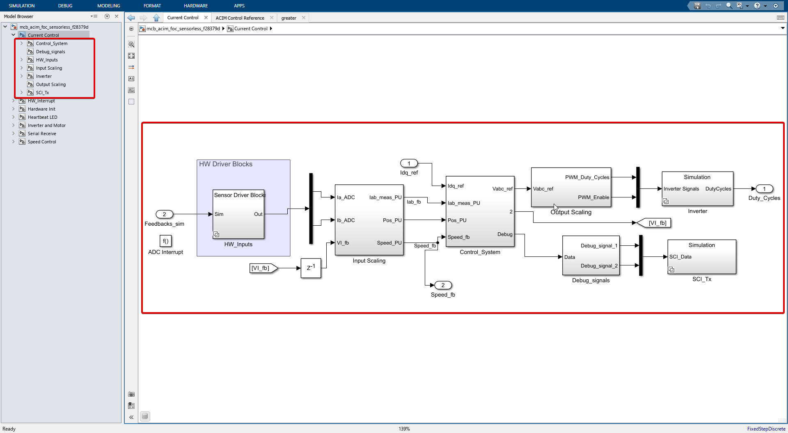

- When we go into the current control subsystem we see there are 7 blocks in total.

- As shown in the tree view (model browser) to the left of the image.

  - **Current Control**
    - HW_Inputs
    - Input Scaling
    - Control_System
    - Output Scaling
    - Inverter
    - Debug_signals
    - SCI_Tx

- Let's go through each of these blocks one by one.

---

## HW_Inputs

This block just reads motor's current Ia, and Ib from ADC_c and ADC_b respectively.

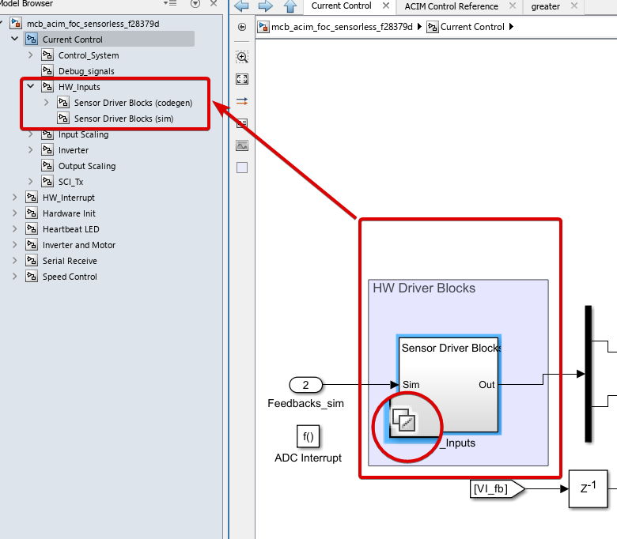

- Notice the stacked square icon the bottom left of the block, it means as we already said this block behaves differently in the real hardware and in the simulation mode.

**In simulation mode**
  - See the Port numbered 2 below it it's labelled as Feedback_sim, which is nothing but the motor currents Ia and Ib, so naturally when in simulation mode we get these current and forward straight away to the outputs.
  - And when we see the blocks inside we see just that.
  
  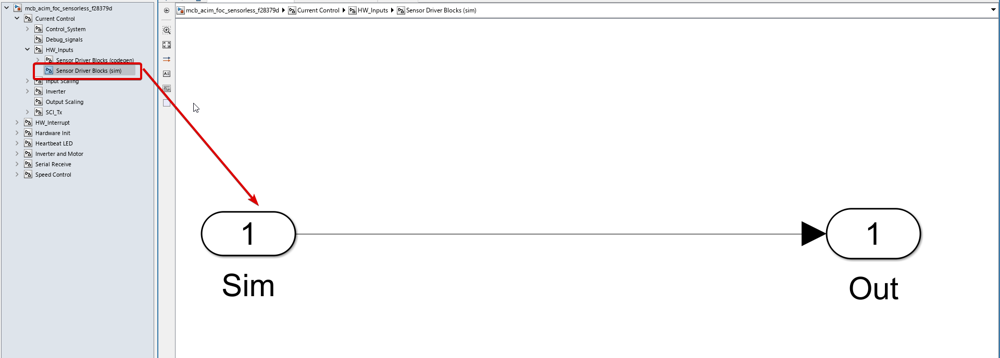

**In code generation mode** (real hardware mode)
  - The signal which is Feedback_sim is useless, so it's not connected to anything.
  - Instead, the real motor currents are read from the ADCs and when we go inside the block we see just that 2 special blocks which are used to read the motor currents from the ADCs. 
  - 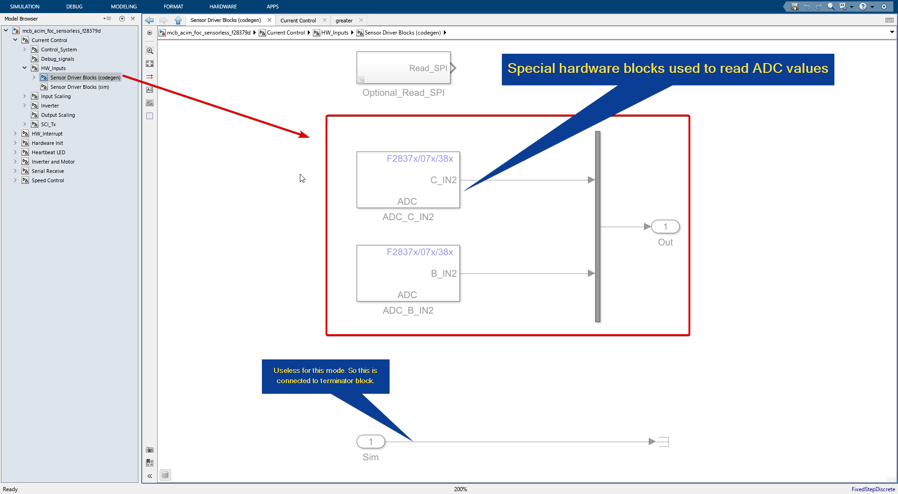
  
  **Closer look at the ADC block**
  - 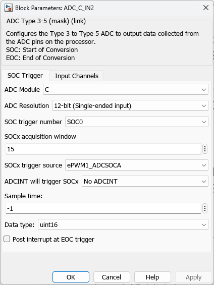
    - **ADC Module C**: This refers to the specific Analog to Digital Converter (ADC) module being used on the F23879D launchpad. The C2000 series has multiple ADC modules (A, B, C, etc.), and in this case, ADC Module C is being used.

    - **ADC Resolution 12-bit (Single-ended input)**: This specifies the resolution of the ADC. A 12-bit resolution means the ADC can represent the analog input as one of 4096 different values (2^12). A single-ended input means the ADC is measuring the voltage difference between the input signal and ground, as opposed to differential input which measures the voltage difference between two input signals.

    - **SOC trigger number SOC0**: SOC stands for Start of Conversion. This is the event that triggers the ADC to start converting an analog signal to a digital one. SOC0 is the specific trigger event being used.

    - **SOC acquisition window 15**: This is the length of time the ADC will sample the analog signal before it starts conversion. The unit of time is typically in ADC clock cycles.

    - **SOC trigger source ePWM1_ADCSOCA**: This specifies the source that triggers the start of conversion (SOC). In this case, it's the ADCSOCA signal from the ePWM1 module.

    - **ADCINT will trigger SOCx No ADCINT**: ADCINT is an interrupt signal from the ADC. This line is saying that ADCINT is not being used to trigger the start of conversion (SOC).

    - **Sample time -1**: This specifies the rate at which the ADC samples the input signal. A value of -1 typically means that the sample time is inherited from the driving block.

    - **Data type uint16**: This is the data type of the digital output from the ADC. uint16 means it's an unsigned 16-bit integer.

    - **Post interrupt at EOC trigger**: EOC stands for End of Conversion. This line means that an interrupt will be generated when the ADC finishes converting the analog signal to a digital one.

## Input Scaling

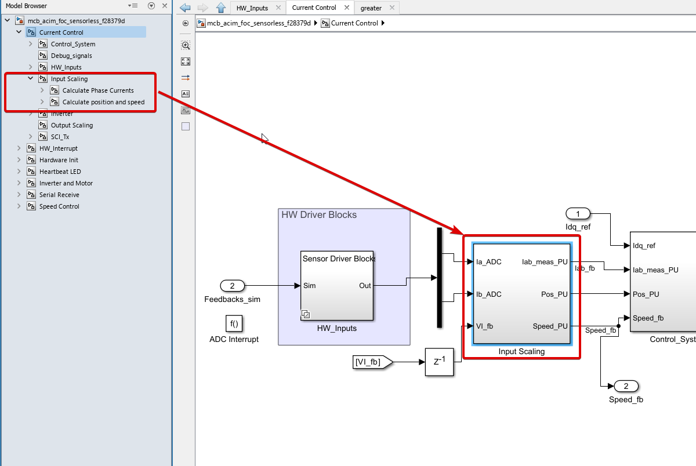

We now move to the Input Scaling block, So this block has 3 inputs namely

1. Ia_ADC
2. Ib_ADC
3. VI_fb

And 3 outputs namely
1. Iab_meas_PU
2. POS_PU
3. Speed_PU

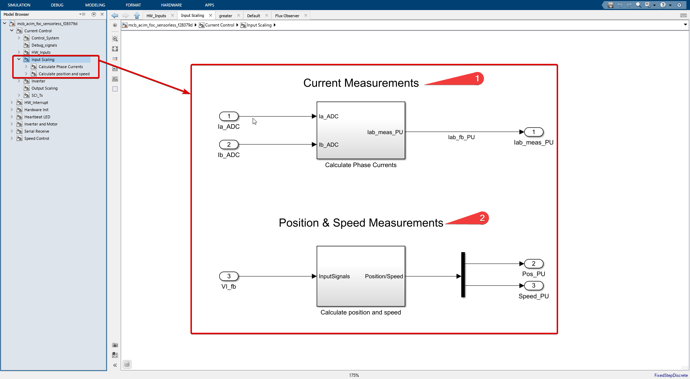

This block does 2 this mainly
1. Data type conversion of received signals from ADCs.
2. Estimation of the stator flux angle (position) and speed of the motor. (since we are doing sensorless i.e. we only measure the motor currents and not the rotor position and speed) 

#### 1. Current Measurements

- This block is rather simple compared to next block (Flux Observer) which we will see later.

- Now into the current measurements block

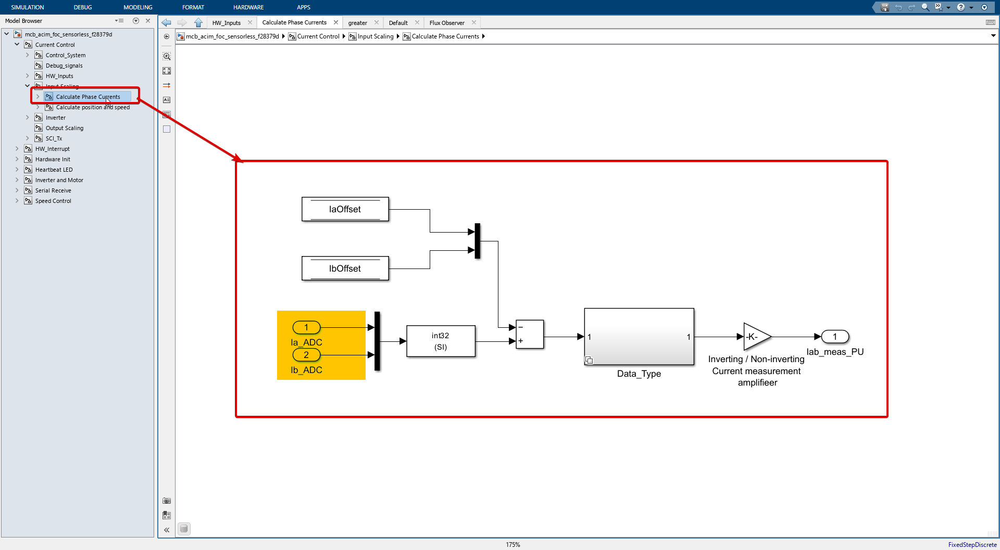

- We the 2 inputs Ia_ADC and Ib_ADC are converted to int32 and subtracted from Ia_offset and Ib_offset respectively.

- The Ia_offset and Ib_offset are calibrated by us. 

- The subtracted values goes to `DataType` block. We shall see what this block does.

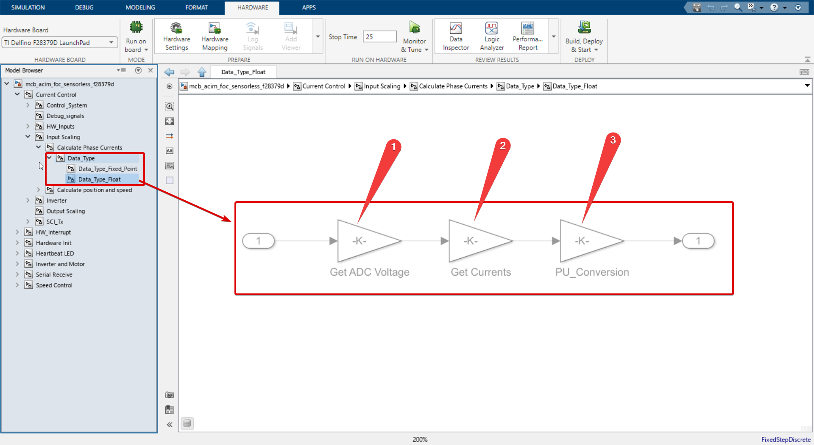

- There are 3 gain blocks where the input values are multipled by 
  - 1. Get ADC voltage  target.ADC_Vref /target.ADC_MaxCount
    - Where target.ADC_Vref = 3.3V and target.ADC_MaxCount = 4096 for our case.
  - 2. Get Currents 1/inverter.ISenseVoltPerAmp
    - inverter.ISenseVoltPerAmp = inverter.ISenseVoltPerAmp * inverter.ADCGain
  - 3. PU_Conversion 1/PU_System.I_base of our motor.

#### 2. Position and Speed measurements

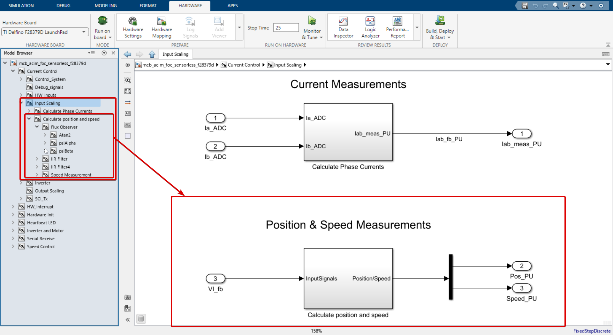

- Let's just recap what signal is entering this block.

  - VI_fb is the motor voltage and current both in $\alpha \beta$ frame of reference.
  - With the help of these signals we can estimate the rotor position and speed of the motor.

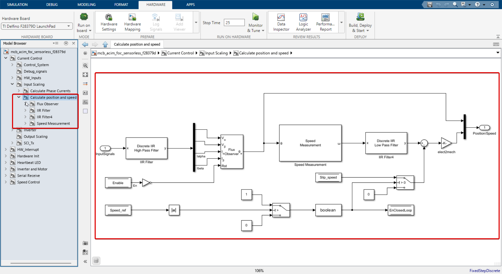

- As we said both voltages and currents come through port 1 shown in the image above. 
- These go through high pass filter for removing low frequency noise.
  - Filter coeff. of this highpass filter is calcuated thusly can be found in `mcb_acim_foc_sensorless_f2879d_data.m` file and is as 
  - $\text{Filter coeff.} = \frac{2\pi T_s f_{cutoff}}{2\pi T_s f_{cutoff} + 1}$
- This filtered signals are then fed to the `Flux Observer` block which estimates stator flux angle. This is an in-built block in the simulink library. If you want to know more about this block you can read about it [here](./Flux_Observer.md)

