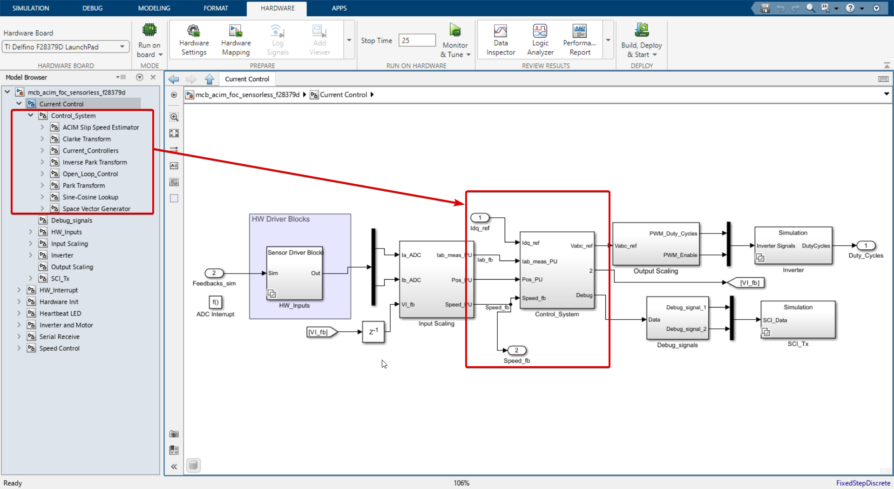
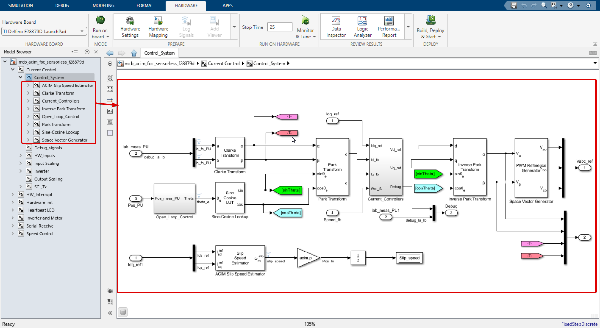
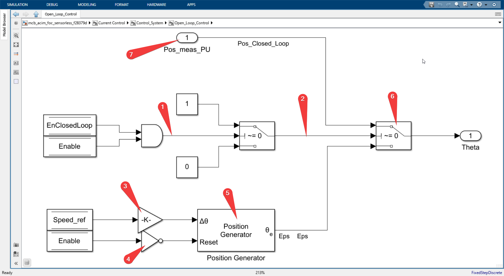
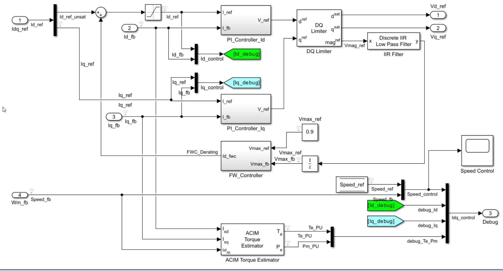
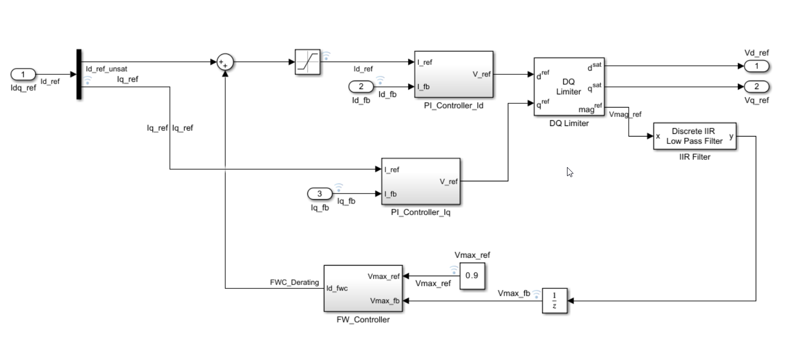

# Current control

This is where guts of FOC lies.


- As we can see in the above image there are 2 inputs to this Current control system, Namely

    - Idq_ref from the speed control system.
    - Feedback_sim signal from the inverter and motor system which is nothing but motor currents of Ia and Ib.


- When we go into the current control subsystem we see there are 7 blocks in total.

- As shown in the tree view (model browser) to the left of the image.

  - **Current Control**
    - HW_Inputs
    - Input Scaling
    - Control_System
    - Output Scaling
    - Inverter
    - Debug_signals
    - SCI_Tx

- Let's go through each of these blocks one by one.

---

## HW_Inputs

This block just reads motor's current Ia, and Ib from ADC_c and ADC_b respectively.


- Notice the stacked square icon the bottom left of the block, it means as we already said this block behaves differently in the real hardware and in the simulation mode.

**In simulation mode**
  - See the Port numbered 2 below it it's labelled as Feedback_sim, which is nothing but the motor currents Ia and Ib, so naturally when in simulation mode we get these current and forward straight away to the outputs.
  - And when we see the blocks inside we see just that.
  
  

**In code generation mode** (real hardware mode)
  - The signal which is Feedback_sim is useless, so it's not connected to anything.
  - Instead, the real motor currents are read from the ADCs and when we go inside the block we see just that 2 special blocks which are used to read the motor currents from the ADCs. 
  - 
  
  **Closer look at the ADC block**
  - 
    - **ADC Module C**: This refers to the specific Analog to Digital Converter (ADC) module being used on the F23879D launchpad. The C2000 series has multiple ADC modules (A, B, C, etc.), and in this case, ADC Module C is being used.

    - **ADC Resolution 12-bit (Single-ended input)**: This specifies the resolution of the ADC. A 12-bit resolution means the ADC can represent the analog input as one of 4096 different values (2^12). A single-ended input means the ADC is measuring the voltage difference between the input signal and ground, as opposed to differential input which measures the voltage difference between two input signals.

    - **SOC trigger number SOC0**: SOC stands for Start of Conversion. This is the event that triggers the ADC to start converting an analog signal to a digital one. SOC0 is the specific trigger event being used.

    - **SOC acquisition window 15**: This is the length of time the ADC will sample the analog signal before it starts conversion. The unit of time is typically in ADC clock cycles.

    - **SOC trigger source ePWM1_ADCSOCA**: This specifies the source that triggers the start of conversion (SOC). In this case, it's the ADCSOCA signal from the ePWM1 module.

    - **ADCINT will trigger SOCx No ADCINT**: ADCINT is an interrupt signal from the ADC. This line is saying that ADCINT is not being used to trigger the start of conversion (SOC).

    - **Sample time -1**: This specifies the rate at which the ADC samples the input signal. A value of -1 typically means that the sample time is inherited from the driving block.

    - **Data type uint16**: This is the data type of the digital output from the ADC. uint16 means it's an unsigned 16-bit integer.

    - **Post interrupt at EOC trigger**: EOC stands for End of Conversion. This line means that an interrupt will be generated when the ADC finishes converting the analog signal to a digital one.

## Input Scaling


We now move to the Input Scaling block, So this block has 3 inputs namely

1. Ia_ADC
2. Ib_ADC
3. VI_fb

And 3 outputs namely
1. Iab_meas_PU
2. POS_PU
3. Speed_PU


This block does 2 this mainly
1. Data type conversion of received signals from ADCs.
2. Estimation of the stator flux angle (position) and speed of the motor. (since we are doing sensorless i.e. we only measure the motor currents and not the rotor position and speed) 

#### 1. Current Measurements

- This block is rather simple compared to next block (Flux Observer) which we will see later.

- Now into the current measurements block


- We the 2 inputs Ia_ADC and Ib_ADC are converted to int32 and subtracted from Ia_offset and Ib_offset respectively.

- The Ia_offset and Ib_offset are calibrated by us. 

- The subtracted values goes to `DataType` block. We shall see what this block does.


- There are 3 gain blocks where the input values are multipled by 
  - 1. Get ADC voltage  target.ADC_Vref /target.ADC_MaxCount
    - Where target.ADC_Vref = 3.3V and target.ADC_MaxCount = 4096 for our case.
  - 2. Get Currents 1/inverter.ISenseVoltPerAmp
    - inverter.ISenseVoltPerAmp = inverter.ISenseVoltPerAmp * inverter.ADCGain
  - 3. PU_Conversion 1/PU_System.I_base of our motor.


#### 2. Position and Speed measurements


- Let's just recap what signal is entering this block.

  - VI_fb is the motor voltage and current both in $\alpha \beta$ frame of reference.
  - With the help of these signals we can estimate the rotor position and speed of the motor.


- As we said both voltages and currents come through port 1 shown in the image above. 
- These go through high pass filter for removing low frequency noise.
  - Filter coeff. of this highpass filter is calcuated thusly can be found in `mcb_acim_foc_sensorless_f2879d_data.m` file and is as 
  - $\text{Filter coeff.} = \frac{2\pi T_s f_{cutoff}}{2\pi T_s f_{cutoff} + 1}$
- This filtered signals are then fed to the `Flux Observer` block which estimates stator flux position. This is an in-built block in the simulink library. If you want to know more about this block you can read about it [here](./Flux_Observer.md)

- The estimated stator flux position is then fed to the `Speed Estimation` block which estimates the speed of the motor $\omega$ this is also an in-built block in the simulink library. If you want to know more about this block you can read about it [here](./Speed_Estimation.md)

- The estimated speed goes through low pass filter to remove high frequency noise, and the filter parameters are as follows

```matlab
% IIR Filter for speed
IIR_filter_speed.type           = 'Low-pass';
IIR_filter_speed.min_speed      = 50; %rpm
IIR_filter_speed.f_cutoff       = IIR_filter_speed.min_speed*acim.p/(120/2); %Hz
IIR_filter_speed.coefficient    = 2*pi*Ts*IIR_filter_speed.f_cutoff/(2*pi*Ts*IIR_filter_speed.f_cutoff + 1);
IIR_filter_speed.time_const     = 1/(2*pi*IIR_filter_speed.f_cutoff);
IIR_filter_speed.delay_ss       = 4*IIR_filter_speed.time_const;
```

- Now as you see in the image above the estimated stator flux's speed is subtracted with slip speed to get the rotor speed.
  - Let's look at an example to understand this better.
    - Say Stator speed  = 1pu,
    - Slip speed = 0.1 pu (we know this from slip speed estimation block we will see next)
    - Rotor speed = 1 - 0.1 = 0.9 pu
  - This is how we get the rotor speed.
- Then we are dividing my pole pairs to get the mechanical speed of the motor from electrical speed.

## Control_System

 

Here is where actual control system is implemented. All the values we calculated in the previous block are used here, Idq_ref, Iab_meas_PU, POS_PU, Speed_PU, and the output of this block is the voltage V_abc reference for the inverter.


 

## Open_loop_Control subsystem



Inside the subsystem we see the position measured per unit which is the signal port 1 labeled 7 comes from the flux observer block in the previous subsystem we saw. So that is the position of the stator flux which goes to the theta only if the enable close to flag and enable flag both are 1. So you can easily verify it from the logic gates.


else so if any of the condition is false that is if enable closed loop is false which means the system is running in the open loop mode or the enable is false which disables the complete systems so if any of those two is false then we go to the below labeled block number five which generates position based on the speed reference and the gain K labeled 3 is nothing but

`Ts*PU_System.N_base*acim.p/60`

Where
- Ts is the sampling time
- PU_System.N_base is the base speed of the motor
- acim.p is the number of pole pairs of the motor
- 60 time conversion factor.

The position generator block is inbuilt in the simulink library and is used to generate the position of the stator flux in the open loop mode given the speed reference.

**DQO transformation**

After we get theta that is stator flux position either in the open loop or the closed loop mode. We use that theta to compute sin theta and cos theta which is used by the Park transform block to calculate the DQ components of the stator currents and these transformed DQ currents is fed into the current controllers block.

## Current controllers



Actually the current controllers are implemented in the `Control_System` with all the debug signals.



For the sake of explanation I have removed all the debuggings and the signals which can distract us from the main goal of understanding the current controllers.

The inputs to this block are

- Idq_ref (which we get from the speed control system)
- Id_fb and Iq_fb (which are transformed currents from the park transform block)
- Wm_fb (which is estimated speed of the rotor from the speed estimation block we saw in the input scaling block)

- The system begins by applying Proportional-Integral (PI) controllers to the q-axis and d-axis currents of the induction machine. These controllers generate a reference voltage based on the difference between the reference current and the feedback current. The aim of this step is to minimize the error between the actual and desired currents.

- Next, a limiter is applied to the d-axis and q-axis reference voltages. This step ensures that these voltages don't exceed certain thresholds, thus preventing potential damage to the system or suboptimal operation. The limiter also calculates the magnitude of the reference vector.

- The limited or saturated d-axis and q-axis voltages are then assigned as the reference voltages. This step ensures that the reference voltages used in the subsequent steps of the process are within the safe operating limits of the system.

- Following this, a low-pass Infinite Impulse Response (IIR) filter is applied to the magnitude of the reference vector. This step is designed to smooth out the reference signal, reducing high-frequency noise and fluctuations that could negatively impact the performance of the system.

- The system then sets a maximum reference voltage. This is a predetermined value that represents the highest voltage that the system is designed to handle.

- The next step involves a feedforward controller, which uses the maximum reference and feedback voltages to generate a corrective d-axis current. This current is designed to anticipate and correct potential errors or disturbances in the system, improving its overall performance.

- The corrective current from the feedforward controller is then added to the reference d-axis current. This step adjusts the reference d-axis current based on the output of the feedforward controller, further fine-tuning the control of the system.

- Finally, a saturation function is applied to the adjusted d-axis current. This step ensures that the current stays within specified limits, reducing the operating level of the system if necessary to prevent overloading or overheating. This is the derating process, which is designed to ensure safe and reliable operation of the system under different conditions.

> The above explanation was generated with GPT-4, by giving this pseudo code which I gave
```csharp
// PI_controller_Iq funtion
(float V_ref) PI_controller_Iq(I_ref, I_fb);
(float V_ref) PI_controller_Id(I_ref, I_fb);
(dsat, qsat, magref)DQLimter(d_ref, q_ref)
Vd_ref = dsat
Vq_ref = qsat

Vmax_fb = LP_IIRfilter(magref)
Vmax_ref = 0.9

// FWC_Derating
Id_fwc = FW_controller(Vmax_ref,Vmax_fb)

Id_ref_unsat = Id_ref + Id_fwc
Id_ref_unsat = saturation(Id_ref_unsat, upperLim = 0.5, lowerLim = 0.05) 
```
https://chatkit.app/s/MBWSDeSxxSD-HjYUh4B1x

After that, we transform the output reference voltage, direct and quadrature voltage into alpha, beta.

The alpha beta frame voltages is given to **PWM reference generator** block which is an inbuilt block in MATLAB and the various pulse width modulation techniques can be selected. For now we have selected a space vector modulation. So this block gets the V alpha V beta voltages and generates the three phase voltages in the stator frame which after scaling can be given directly to the gate pulses of the inverter.