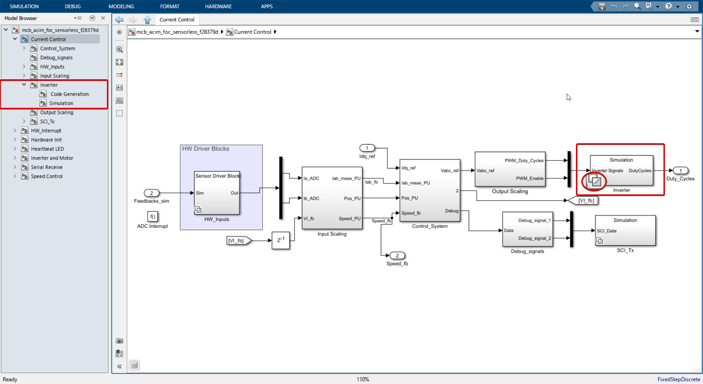
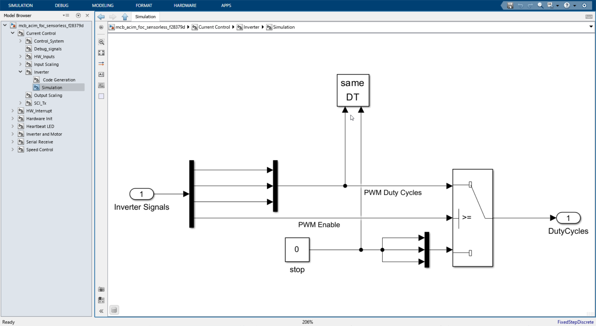
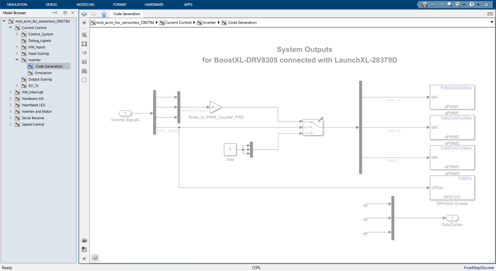

# Inverter in simulation mode.

Here the inverter gate signals from previous subsystem is passed through Port 1 (DutyCycles) if the Enable flag is high. If the Enable flag is low then the inverter gate signals are set to zero.

There is a block called same DT connected to both PWM signals and enable flag. This block is used to make sure that the PWM signals and enable flag are of same data type.

# Inverter in real hardware mode.

- The inverter gate signals is multiplied with gain `Scale_to_PWM_Counter_PRD` and this signal is passed to PWM_A (ePWM1), PWM_B (ePWM2) and PWM_C (ePWM3).

# ePWM module a closer look.

[ePWM module](./ePWM.md)
