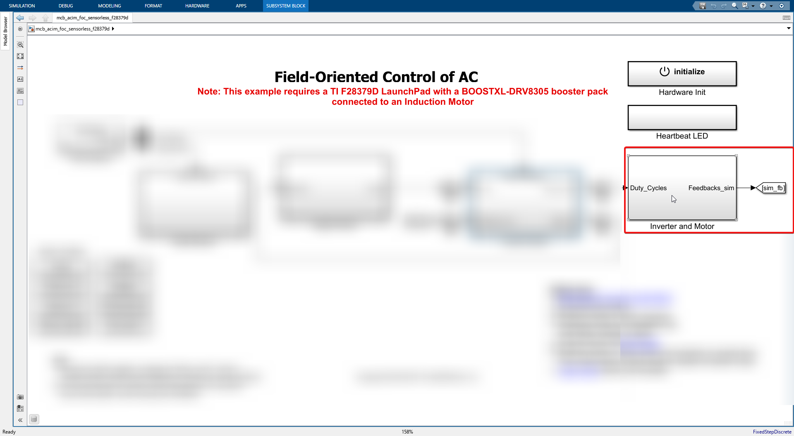
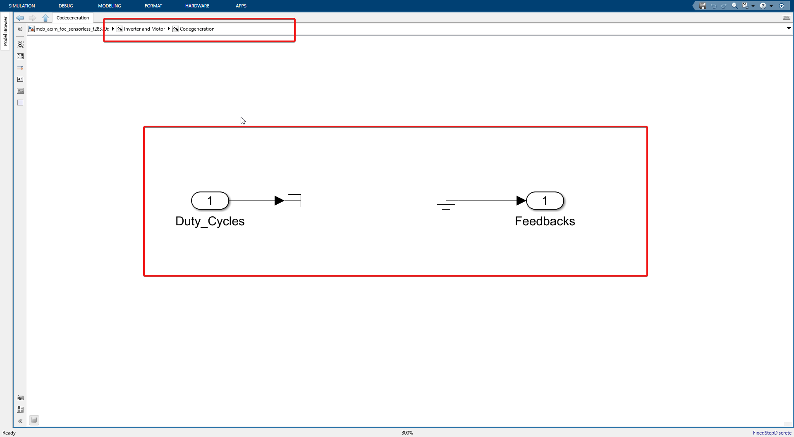

# Inverter and motor

The inverter and motor subsystem is the final stage of the Field Oriented Control (F.O.C.).

# Simulation mode

In simulation mode, We use virtual motor and inverter blocks to simulate.

# Code generation mode

In code generation mode, we use the actual motor and inverter blocks to generate the code for the C2000 microcontroller i.e. the ePWM module will produce the PWM signals to drive the motor and from the actual motor we will be getting the feedback signals. There is nothing to be done in this block for code generation mode.

And when we go into this block we see just that for code generation mode.

