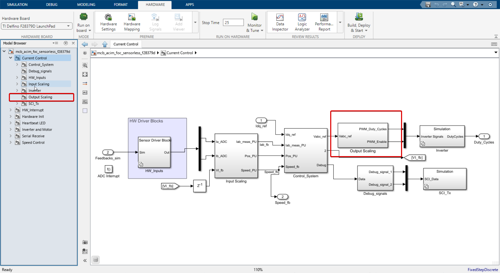

Pretty self-explanatory, isn't it?

Vabc_ref is multiplied by 1/2 and added with 0.5 to get Vabc_ref_scaled. This is done to scale the input to the range of 0 to 1. 

and Enable flag goes through a simple data type conversion.