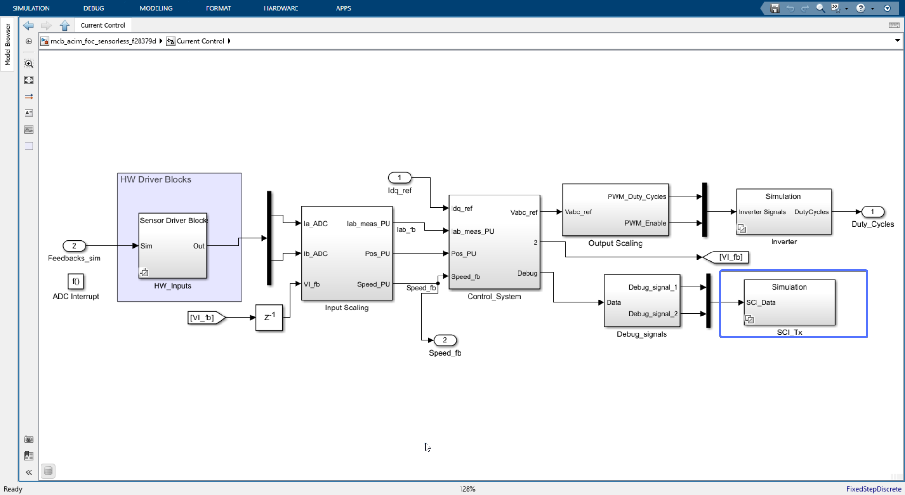
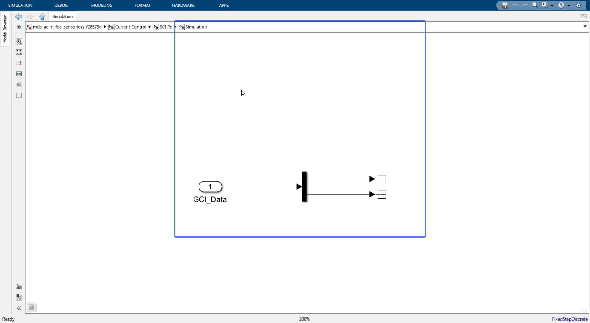
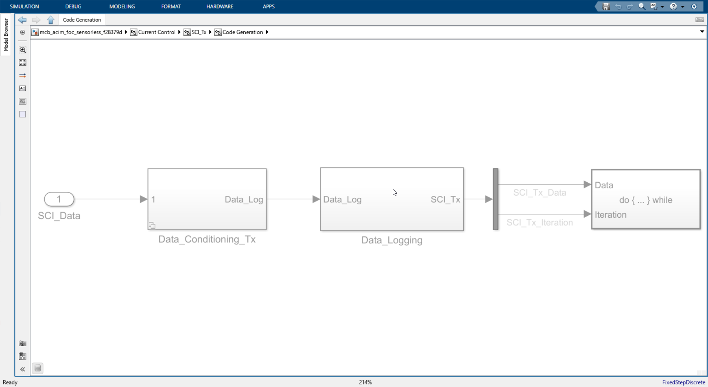

# SCI_tx

The debug signals [Debug_signals](./Debug_signals.md) are sent to the SCI Tx block. 

# In Simulation mode

In simulation mode we don't need to send the debug signals to the SCI Tx block. So we use a terminator block to terminate the signals.  

# Hardware (code generation) mode

Only when this code is running on the C2000 we need to send the data from the controller to host PC. 

> The blocks seems grayed out because the default mode in simulink is simulation mode.

The debug signals are sent to Data_Conditioning_Tx then to Data_Loggging then finally 