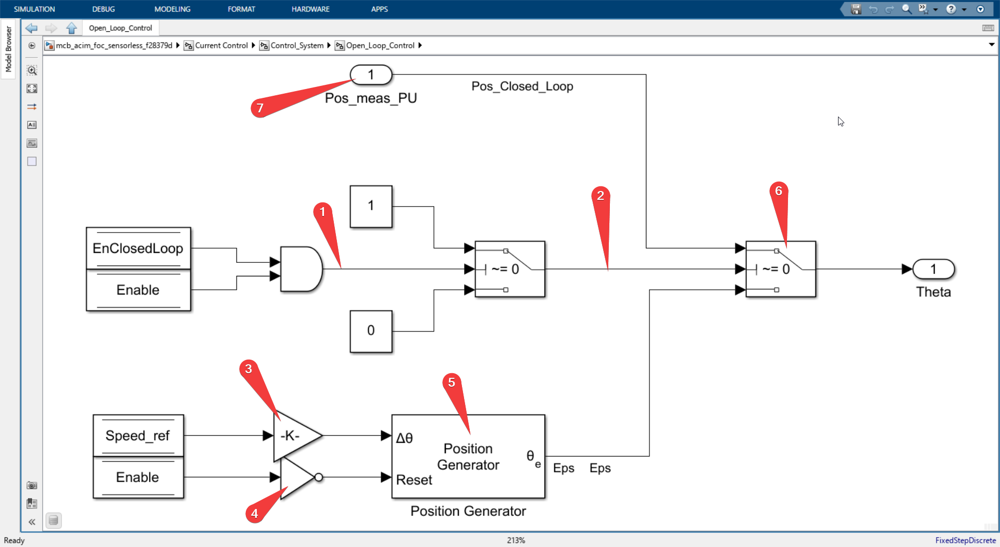
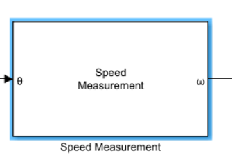
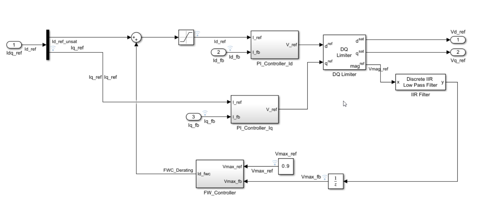
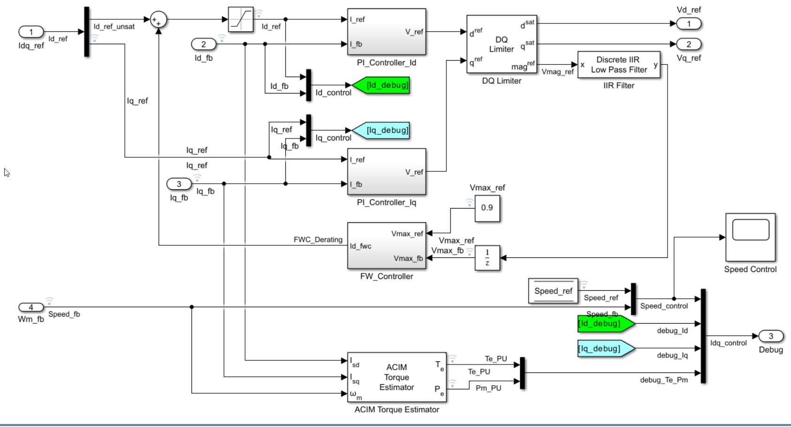
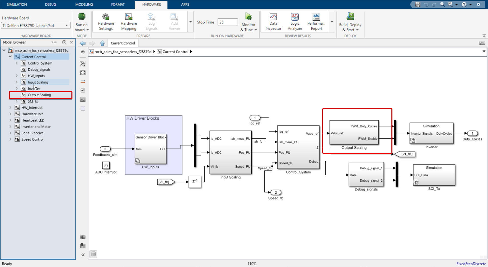
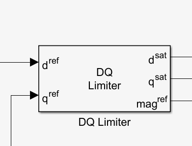

# Speed control





I will refer to numbers in the image above to explain follow along.

**Numbered 1**
It's the DataStoreRead block which holds the speed reference value which we send from our host computer through serial communication.


**Numbered 2**
It's Discrete IIR lowpass filter block which is added to the plant cancel the Zeros (the one which makes the output of transfer function to zero) by adding poles.

So effectively we are adding poles by adding this filter to cancel the zeros in our system. 

`IIR_filter_speed.coefficient*(Ts_speed/Ts)` is filter coefficient. 

Ts is sample time of the system and Ts_speed sample time of the speed control system.
```
Ts          	= T_pwm (1.0/20Khz in our case)

Ts_speed        = 30*Ts
```


**Numbered 3**
It's the Discrete PID Controller with anti-windup block which takes speed_ref and speed_fb as input and generates torque_ref as output.



more closer look into the PID block

Follow the numbers in the image above to understand the PID block.

1. -> Proportional gain
2. -> Integral gain * Sample time of this system Ts_speed
3. Boolean flag `EnClosedLoop` is used to reset the integrator when the system enters the closed loop.

The reset signal is level triggered 

Source: Docs of Discrete PID Controller with anti-windup block (which can be opened by right clicking on the block and clicking on the help)



4. Initial condition of the integrator is set to 0.0

**Numbered 4**

is a port which is from current motor speed feedback value estimated by the Speed Estimation block.

**Numbered 5**



ACIM Control reference, This is inbuilt block in the ACIM Control library which takes torque_ref and speed_ref as input and generates Isd_ref and Isq_ref as output, which are the reference values for the current control loop.

As you can see this block takes a lot of machine specific parameters like rated flux, poles, rated speed, inductances and generates the Id and Iq reference values.

ACIM Control reference computes it's internal Id and Iq gains based on the paramters we provide using the dialog box, the below code is exacly how it computes the gains.

The below code is from the ACIMControlReferenceCb.m file which is the callback function for the ACIM Control reference block which can be found in the path `C:\Program Files\MATLAB\R2023b\toolbox\mcb\mcbblocks\+mcb\+internal\ACIMControlReferenceCb.m`


Here are the equations used in the code (extracted from the code for easy reference)


$$L_{r} = L_{lr} + L_{m}$$

$$T_{base\_{PU}} = \frac{3}{2} \cdot p \cdot \frac{L_{m}}{L_{r}} \cdot FluxRated \cdot I_{base\_{PU}}$$

$$N_{base\_{PU}} = \frac{60}{2\pi}$$

$$Iq_{gain} = \frac{T_{base\_{PU}}}{\left(\frac{3}{2} \cdot p \cdot \frac{L_{m}^2}{L_{r}}\right) \cdot I_{base\_{PU}}^2}$$

$$Id_{ref} = \frac{FluxRated}{L_{m}} \cdot I_{base\_{PU}}$$

$$Id_{gain} = Id_{ref} \cdot \frac{N_{rated}}{N_{base\_{PU}}}$$

$$Slip\_{speed} = \frac{N_{base} - N_{rated}}{N_{base\_{PU}}}$$

$$I_{max} = \frac{I_{max}}{I_{base\_{PU}}}$$


```matlab
function dlgSett = ACIMControlReferenceCb(objHandle)
% Mask initialization function for MCB/ACIM Control Reference block.
%
% Inputs:
%   objHandle   : Current block handle obtained by gcbh command


%   Copyright 2020-2021 The MathWorks, Inc.

%%
%Do not run initialization code if model is running
invalidStatus = {'external','running','compiled','restarting','paused','terminating'};
if any(strcmpi(get_param(bdroot(objHandle),'SimulationStatus'),invalidStatus))
    
    %Return dummy values
    dlgSett.Id_ref       = 1;
    dlgSett.Id_gain      = 1;
    dlgSett.Iq_gain      = 1;
    dlgSett.Slip_speed   = 1;
    dlgSett.I_max        = 1;
    dlgSett.N_base_PU    = 1;
    
    return
end

% Get system info
this = get_param(objHandle,'Object');
sys = getfullname(objHandle);

% Get Dialog Settings
mEnables = get_param(objHandle,'MaskEnables');
mVisibilities = get_param(objHandle,'MaskVisibilities');
mValues = get_param(objHandle,'MaskValues');

% Resolve parameters
acim.p          = 1;
acim.Llr        = 1;
acim.Lm         = 1;
acim.FluxRated  = 1;
acim.N_rated    = 1;
acim.N_base     = 1;
acim.I_max      = 1;

try
    acim.p          = double(slResolve(this.polePairs,objHandle));
    acim.Llr        = double(slResolve(this.Llr,objHandle));
    acim.Lm         = double(slResolve(this.Lm,objHandle));
    acim.FluxRated  = double(slResolve(this.FluxRated,objHandle));
    acim.N_rated    = double(slResolve(this.N_rated,objHandle));
    acim.N_base     = double(slResolve(this.N_base,objHandle));
    acim.I_max      = double(slResolve(this.I_sat,objHandle));
catch
    %     Do nothing
end

% Compute required inductances
acim.Lr = acim.Llr + acim.Lm;

% Initialize PU values
dlgSett.I_base_PU = 1;
dlgSett.N_base_PU = 1;
dlgSett.T_base_PU = 1;

switch this.Units
    case 'Per-Unit (PU)'
        try
            dlgSett.I_base_PU = double(slResolve(this.I_base,objHandle));
        catch
            %     Do nothing
        end
        dlgSett.N_base_PU = acim.N_base;
        dlgSett.T_base_PU = (3/2)*acim.p*(acim.Lm/acim.Lr)*acim.FluxRated*dlgSett.I_base_PU;
        set_param(objHandle,'MaskDisplay','mcb.internal.drawIcons(''ACIM Control Reference'',1);');
    case 'SI Units'
        dlgSett.I_base_PU = 1;
        dlgSett.N_base_PU = (60/(2*pi));
        dlgSett.T_base_PU = 1;
        set_param(objHandle,'MaskDisplay','mcb.internal.drawIcons(''ACIM Control Reference'',2);');
end

dlgSett.Iq_gain     = (dlgSett.T_base_PU)/(((3/2)*acim.p*(acim.Lm^2/acim.Lr))*(dlgSett.I_base_PU^2));
dlgSett.Id_ref      = (acim.FluxRated/(acim.Lm))/dlgSett.I_base_PU;
dlgSett.Id_gain     = (dlgSett.Id_ref)*(acim.N_rated/dlgSett.N_base_PU);
dlgSett.Slip_speed  = (acim.N_base - acim.N_rated)/dlgSett.N_base_PU;
dlgSett.I_max       = acim.I_max/dlgSett.I_base_PU;

%% Update Base Value for Torque

%Checking updated value
newValue = num2str(dlgSett.T_base_PU);
oldValue = get_param(sys,'T_base');

if ~strcmp(oldValue, newValue)
    mEnables(10) = {'on'};
    set_param(objHandle,'MaskEnables',mEnables);
    
    set_param(sys,'T_base',num2str(dlgSett.T_base_PU));
    
    mEnables(10) = {'off'};
    set_param(objHandle,'MaskEnables',mEnables);
end

end
```


## DQ limiter block




For DQ equivalence:
$$\text{mag}^{ref} = \sqrt{(\text{d}^{ref})^2 + (\text{q}^{ref})^2}$$

When \(\text{mag}^{ref} > \text{x}_{max}\):
$$\text{d}^{sat} = \frac{\text{d}^{ref}}{\text{mag}^{ref}} \text{x}_{max}$$
$$\text{q}^{sat} = \frac{\text{q}^{ref}}{\text{mag}^{ref}} \text{x}_{max}$$

When \(\text{mag}^{ref} \leq \text{x}_{max}\):
$$\text{d}^{sat} = \text{d}^{ref}$$
$$\text{q}^{sat} = \text{q}^{ref}$$

Where, \(\text{x}_{max}\) is the saturation limit.

When D-axis is prioritized:
$$\text{mag}^{ref} = \sqrt{(\text{d}^{ref})^2 + (\text{q}^{ref})^2}$$
$$\text{d}^{sat} = \min(\max(\text{d}^{ref}, -\text{x}_{max}), \text{x}_{max})$$
$$\text{q}^{sat} = \text{sign}(\text{q}^{ref}) \times \min\left( \left| \text{q}^{ref} \right|, \sqrt{\text{x}_{max}^2 - (\text{d}^{sat})^2} \right)$$

Where, \(\text{x}_{max}\) is the saturation limit.

When Q-axis is prioritized:
$$\text{mag}^{ref} = \sqrt{(\text{d}^{ref})^2 + (\text{q}^{ref})^2}$$
$$\text{q}^{sat} = \min(\max(\text{q}^{ref}, -\text{x}_{max}), \text{x}_{max})$$
$$\text{d}^{sat} = \text{sign}(\text{d}^{ref}) \times \min\left( \left| \text{d}^{ref} \right|, \sqrt{\text{x}_{max}^2 - (\text{q}^{sat})^2} \right)$$


The above are equations from DQ limiter block in simulink. Source: Mathworks documentation

The DQ limiter block in Simulink is designed to limit the magnitude of a vector represented in the d-q reference frame, which is commonly used in the analysis and control of three-phase AC machines. The d and q components represent the direct and quadrature components of a vector, usually voltage or current. 

The complexity of the DQ limiter block arises from the need to maintain the original direction of the vector while limiting its magnitude. This requires more than simple clamping of the d and q components. 

When the magnitude of the vector exceeds a specified saturation limit, the DQ limiter block scales down the d and q components proportionally to bring the magnitude down to the saturation limit. 

However, there are situations where one component (either d or q) is more important than the other. In these cases, the DQ limiter block provides the option to prioritize one component. The prioritized component is clamped to the saturation limit if necessary, and the other component is adjusted to maintain the original direction of the vector, while ensuring that the magnitude does not exceed the saturation limit. 

This adjustment is achieved using the Pythagorean theorem to calculate the maximum possible value for the non-prioritized component given the value of the prioritized component and the saturation limit. The sign function is used to maintain the original direction of the vector. This process adds to the complexity of the block, but is necessary to ensure accurate and flexible control of AC machines.


This completes the speed control system.
Next: [Current control](./Current\_control.md)