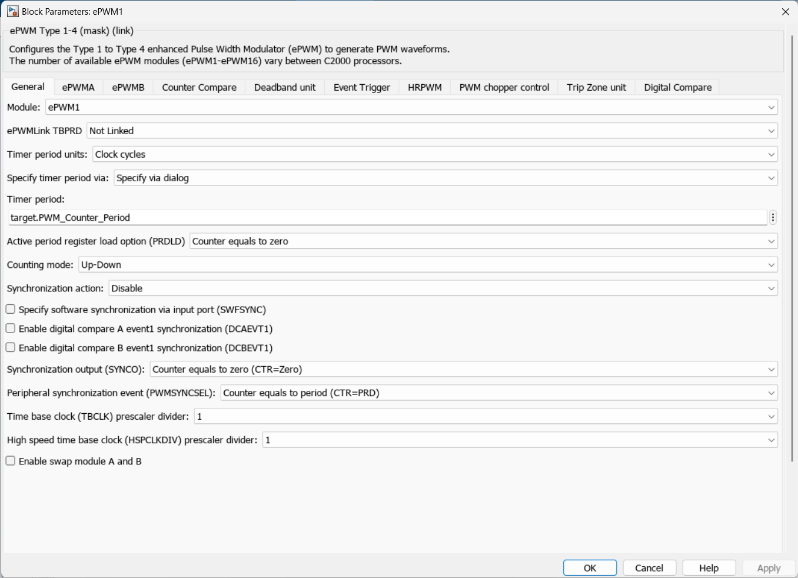
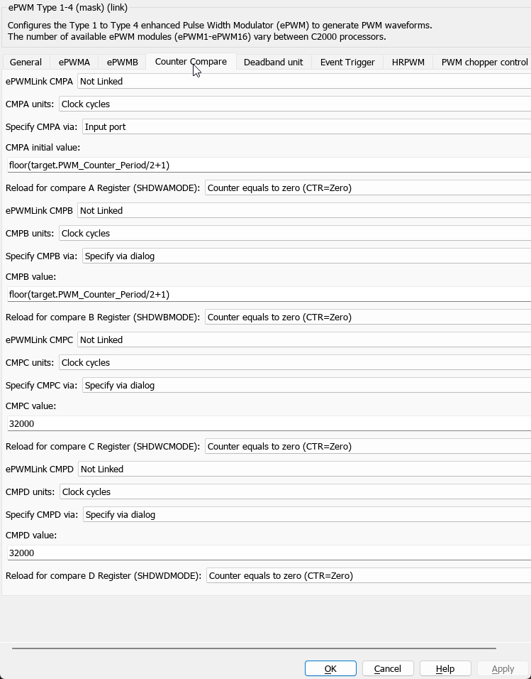

# ePWM

enhanced Pulse Width Modulation (ePWM) is a module in Texas Instruments' TMS320F28379D microcontroller. 

### Tabs

- **ePWMA/B**: Configures settings specific to each PWM channel (A or B), such as duty cycle.
- **Counter Compare**: Settings related to comparing the counter value to a specified value, affecting the PWM output.
- **Deadband unit**: Configures a delay between the rising and falling edges of the PWM signals, typically used in inverter applications to prevent shoot-through.
- **Event Trigger**: Settings for generating events based on counter values, used for interrupts or triggering ADC conversions.
- **HRPWM**: High-Resolution PWM settings, for more precise control over the PWM duty cycle.
- **PWM chopper control**: Configures the chopper feature, which modulates the PWM signal to reduce electromagnetic interference (EMI).
- **Trip Zone unit**: Settings related to fault conditions that can force the PWM outputs to a safe state.
- **Digital Compare**: Configures the digital compare blocks, which can modify PWM outputs based on comparisons between input signals and specified values.

### General tab

- **Module**: Identifies the specific ePWM module being configured (ePWM1 in this case).
- **ePWMLink TBPRD**: Determines if the Timer Period (TBPRD) is linked with another module. "Not Linked" means it operates independently.
- **Timer period units**: Defines the units for the timer period. Here, it's set to "Clock cycles".
- **Specify timer period via**: Indicates how the timer period is specified. "Specify via dialog" means it's manually entered.
- **Timer period**: The actual period of the PWM timer, defined by `target.PWM_Counter_Period`.
- **Active period register load option (PRDLD)**: Specifies when the active period register is loaded. "Counter equals to zero" means it's loaded when the counter is zero.
- **Counting mode**: "Up-Down" means the counter increments until it matches the period, then decrements back to zero.
- **Synchronization action**: Configures synchronization options. Disabling it but enabling specific events for synchronization like digital compare A and B event1.
- **Synchronization output (SYNCO)**: Determines the condition to generate a synchronization output. "Counter equals to zero" means when the counter is zero.
- **Peripheral synchronization event (PWMSSYNCE)**: Specifies when a peripheral synchronization event is generated, here when "Counter equals to period".
- **Time base clock (TBCLK) prescaler divider**: Sets the prescaler for the base clock, with "1" meaning no division.
- **High speed time base clock (HSPCLKDIV) prescaler divider**: Sets the prescaler for the high-speed base clock, also "1" for no division.
- **Enable swap module A and B**: Allows swapping the outputs of modules A and B, not enabled in this case.

## Counter Compare

The "Counter Compare" tab in the ePWM module configuration for a C2000 processor in Simulink focuses on settings related to comparing the PWM counter value against specified values (CMPA, CMPB, CMPC, and CMPD). These comparisons are crucial for defining the duty cycle of the PWM signals. Let's break down each parameter in this section:

### Counter Compare Parameters

- **ePWMLink CMPA**: Determines if the Compare A (CMPA) value is linked with another module. "Not Linked" means CMPA operates independently.
- **CMPA units**: The unit of measurement for the CMPA value, set to "Clock cycles" indicating the comparison is based on the number of clock cycles.
- **Specify CMPA via**: Specifies how the CMPA value is determined. "Input port" means the value is provided through an external input to the block.
- **CMPA initial value**: The initial value for CMPA, calculated as `floor(target.PWM_Counter_Period/2+1)`. This sets the initial duty cycle to approximately 50%.
- **Reload for compare A Register (SHDWAMODE)**: Specifies when the CMPA register is reloaded. "Counter equals to zero" means it reloads whenever the PWM counter resets to zero.

- **ePWMLink CMPB**: Like CMPA, but for Compare B (CMPB), indicating CMPB operates independently when set to "Not Linked".
- **CMPB units**: Also set to "Clock cycles", for consistency with CMPA.
- **Specify CMPB via**: "Specify via dialog" means the CMPB value is manually entered in the block's dialog.
- **CMPB value**: The specified value for CMPB, with the same formula as CMPA, suggesting a similar intention for duty cycle.
- **Reload for compare B Register (SHDWBMODE)**: Like SHDWAMODE, but for CMPB, ensuring it reloads at the counter reset.

- **ePWMLink CMPC/D**: These settings mirror those of CMPA and CMPB but are for Compare C (CMPC) and Compare D (CMPD), respectively. They are also set to operate independently, have their values specified via the dialog, and are set to reload at counter reset. The CMPC and CMPD values here are hardcoded to 32000, which could be used for specific control logic or duty cycle adjustments.

### Key Points

- **Compare Units (CMPA, CMPB, CMPC, CMPD)**: These are critical for defining the PWM signal's duty cycle by comparing the counter value against these set points. Adjusting these values changes when the PWM output toggles, thus altering the duty cycle.
- **Reload Options (SHDWAMODE, SHDWBMODE, SHDWCMODE, SHDWDMode)**: The reload behavior ensures that any changes to the compare values are promptly applied at a predictable point in the PWM cycle, typically at the counter reset. This allows for smooth adjustments to the duty cycle or waveform characteristics during operation.
- **Independence of CMPA/B/C/D**: By not linking these compare values, each can be independently set and adjusted, providing flexibility in generating complex PWM waveforms or controlling multiple outputs differently from a single ePWM module.

These parameters enable precise control over the PWM duty cycle and waveform characteristics, crucial for applications ranging from motor control to power conversion in embedded systems.